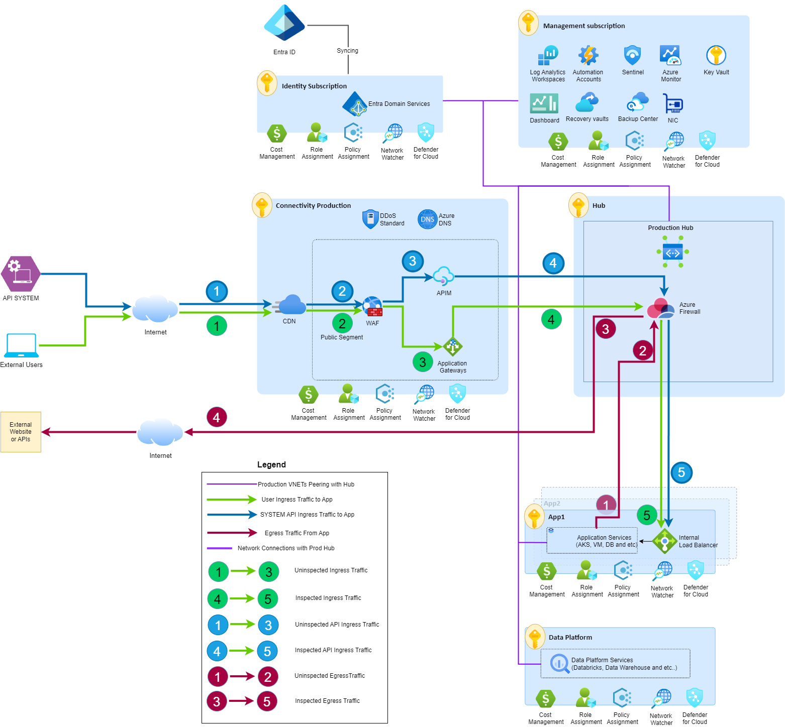
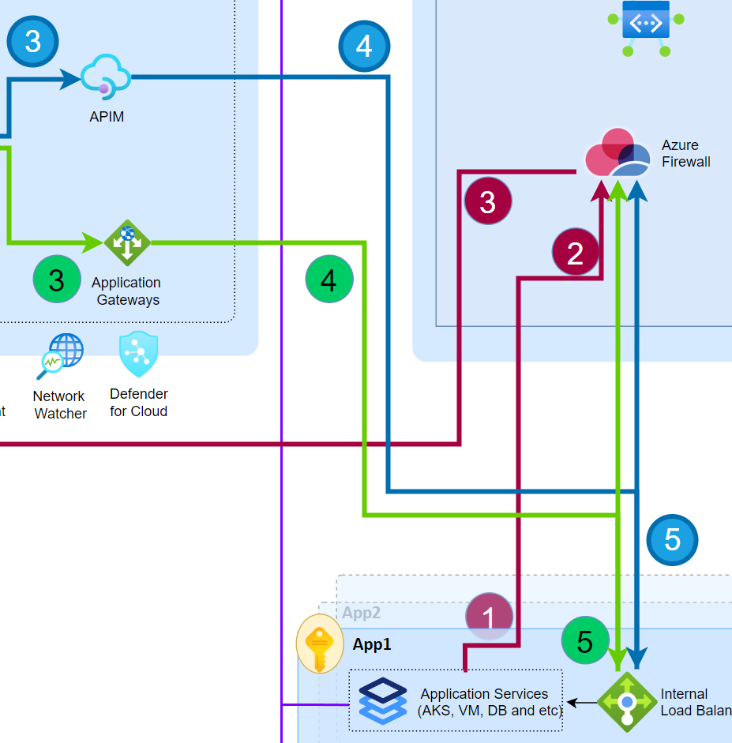
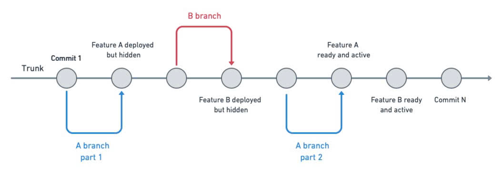
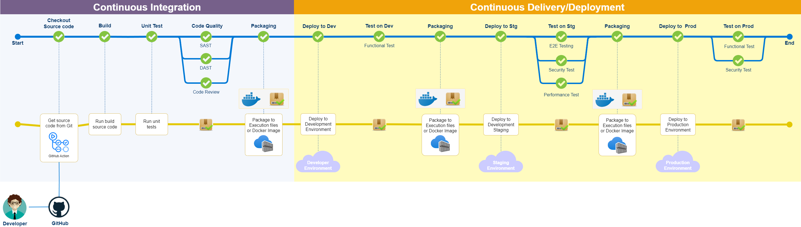
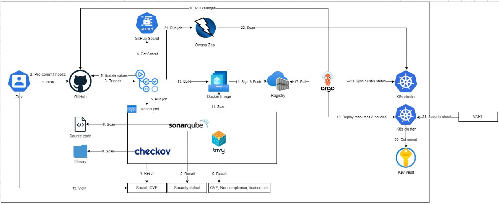

# Plugilo Infrastructure

This document outlines the high-level infrastructure architecture design for Plugilo's global SaaS platform.

## Part 1 – High-Level Infrastructure Architecture

### 1. Context and Requirements

**Platform:**
- 10–15 million users
- Microservices architecture
- Backend services in Node.js / Python / Java
- Databases: PostgreSQL, MongoDB, Elasticsearch, Redis
- AI workloads (GPU optional; no deep ML required)
- Web & mobile clients (Web, iOS, Android)
- Deployed on Azure (primary) with multi-cloud connectivity to AWS and GCP

**Key Requirements:**
- High availability
- Multi-region readiness
- GDPR compliance and security awareness
- Strong cost discipline (startup mindset)

---

## 2. Cloud Provider and Region Strategy

### 2.1 Cloud Provider Selection

**Decision: Azure (Primary) with Multi-Cloud (AWS & GCP) Connectivity**

**Rationale:**
- Cloud-agnostic architecture avoids vendor lock-in
- Azure's OpenAI partnership provides strong AI capabilities
- Multi-cloud connectivity to AWS and GCP for specialized services

**Multi-Cloud Approach:**
- Primary Platform: Azure
- Secondary Clouds: AWS and GCP connectivity via VPN/ExpressRoute for AI services and specialized workloads

### 2.2 Region Strategy

**Regions:**
- **Germany West Central** (Frankfurt): Primary production region
- **Germany North** (Berlin): Secondary region (paired with Germany West Central)

**Key Points:**
- **Paired Regions**: Germany West Central and Germany North form an Azure region pair, providing sequential updates and prioritized recovery ([Azure Region Pairs](https://learn.microsoft.com/en-us/azure/reliability/regions-paired))
- **GDPR Compliance**: Both regions in Germany ensure data residency requirements
- **Multi-Region Strategy**: Active-active applications, active-passive databases with automatic replication

---

## 3. Network Design

This architecture follows the [Microsoft Cloud Adoption Framework (CAF)](https://learn.microsoft.com/en-us/azure/cloud-adoption-framework/) landing zone approach. The network design implements hub-and-spoke topology, ensuring simplicity and scalability.

<strong>Figure 1: High-Level Infrastructure Architecture</strong>

### 3.1 Network Topology

This section illustrates the network design for production environments. Non-production environments follow an identical architecture.

| Component | Subscription | Description |
|-----------|-------------|-------------|
| **Azure Firewall** | Hub Subscription | Network security appliance for traffic inspection. All traffic (inbound and outbound) is inspected by Azure Firewall (DPI, IPS, FQDN/URL filtering, Threat Intelligence, etc.) and must be allowed via firewall policies. |
| **NAT Gateway** | Hub Subscription | Centralized outbound internet connectivity. Provides SNAT for all outbound traffic from spoke VNets. |
| **Private Link** | Hub/Spoke Subscriptions | Private connectivity to Azure services (Key Vault, Storage, ACR, Databases) using the combination of Private Endpoints and Private DNS Zones. |
| **Azure DNS** | Hub Subscription | Domain delegation from external registrars (GoDaddy, CloudFlare) to Azure DNS for centralized DNS management. |
| **Azure Front Door** | Connectivity Production | Global CDN, WAF protection, TLS termination, and intelligent routing to origin groups. |
| **Application Gateway** | Connectivity Production | Regional load balancer, URL-based routing. |
| **APIM** | Connectivity Production | API gateway for authentication, rate limiting, CORS, developer portal, API versioning. |
| **Internal Load Balancer** | App1/App2 | Private load balancer associated with Istio Ingress Gateway for load balancing traffic to microservice pods. |
| **VNet** | All Subscriptions | Hub-and-spoke model. Bidirectional peering between Hub VNet and all spoke VNets (App1/App2, Data Platform, Connectivity Production). No direct spoke-to-spoke peering (transitive routing via Hub). |
| **Subnets** | All Subscriptions | Using IPAM tool for CIDR planning and centralized subnet calculation to prevent IP address overlaps. |

### 3.2 Routing and Connectivity

#### 3.3.1 Traffic Internet Outbound Flow

**(1)** Application in private subnets (AKS pods or AVD) sends request to Internet API endpoint.

**(2)** Route table in spoke VNet routes traffic (`0.0.0.0/0 → Azure Firewall Private IP`) through VNet peering to Hub VNet. Traffic arrives at Hub VNet and is forwarded to Azure Firewall based on route table.

**(3)** Azure Firewall applies security inspection (network rules, application rules, threat detection) and forwards to NAT Gateway for SNAT. NAT Gateway is used instead of Azure Firewall's public IP for SNAT to provide better scalability (Higher SNAT ports per public IP).

**(4)** NAT Gateway performs source NAT (Firewall private IP → NAT Gateway public IP) and sends to Internet. External API response returns. Azure Firewall is stateful and automatically handles return traffic flow.

#### 3.3.2 Traffic Internet Inbound Flow

Application Gateway is positioned in front of Azure Firewall to ensure all inbound traffic is inspected, providing defense-in-depth security (alternative: parallel positioning - see Figure 2).

<strong>Figure 2: Azure Firewall and Application Gateway in Parallel (Alternative Approach - Not Selected)</strong>

**(1)** External user or API system sends request to custom domain. Azure Front Door (CDN) caches static content at edge locations and performs TLS termination, WAF protection, and intelligent routing to corresponding origin.

**(2)** Azure Front Door routes to Application Gateway (user traffic) or APIM (API traffic) via Private Link Service with Private Endpoints.

**(3)** Application Gateway and APIM route to Azure Firewall in Hub VNet via UDR with Azure Firewall as next hop.

**(4)** Azure Firewall performs security inspection and routes to application services. Azure Firewall forwards to Internal Load Balancer (created for Istio Ingress Gateway).

**(5)** Internal Load Balancer distributes to Istio Gateway, which uses Istio Virtual Service to route to appropriate microservice pods. Response follows reverse path back to user.

#### 3.3.3 Traffic from User to Internal System

Production internal systems (databases, monitoring, logging, etc.) should be accessed through Azure Virtual Desktop (AVD) to ensure EU GDPR compliance and data residency requirements (Data must remain within the EU geographic location).

For non-production environments, we must use VPN Solution for secure remote access. Tailscale selected for non-production environments due to cost efficiency, cloud-agnostic architecture, and Kubernetes RBAC integration.

**VPN Solution: Tailscale vs Azure VPN Gateway**

| Aspect | Tailscale | Azure VPN Gateway |
|--------|-----------|-------------------|
| **Cost** | $6 per user/month | ~$200/month (gateway) + bandwidth costs |
| **Cloud Agnostic** | Yes - install on K8s, managed through GitOps | No - Azure-native service |
| **RBAC** | ACL-based access control, Kubernetes RBAC integration | Azure RBAC, limited granularity |

---

## 4. Compute Strategy

### 4.1 Compute Choices

**Containers with Orchestrator (Primary - AKS), Azure Container Instances (ACI) for traffic spikes, VMs (AVD only for admin access)**

**Rationale:**
- **Cloud-Agnostic & Vendor Lock-in Avoidance**: Kubernetes (AKS) is the industry standard, portable across Azure, AWS, and GCP. Container-based workloads can be migrated between cloud providers without vendor lock-in.
- **Avoid Serverless**: We avoid using any serverless services (Azure Functions, AWS Lambda, GCP Cloud Functions) to maintain cloud portability and avoid vendor lock-in.
- **Traffic Spike Handling**: Azure Container Instances (ACI) used for traffic spikes and burst capacity (see Part 3 for scaling strategy).
- **AI Workloads**: AKS supports GPU nodes (e.g., Standard_NC6s_v3) for AI/ML workloads.
- **Admin Access**: VMs only for Azure Virtual Desktop (AVD) with compliance hardening in production for GDPR-compliant admin access. No application workloads hosted on VMs.

### 4.2 Kubernetes Strategy

**Multi-Cluster Architecture:**
- **Active-Active Clusters**: Two AKS clusters (primary and secondary) for high availability and disaster recovery
- **Traffic Distribution**: Azure Front Door routes internet-facing traffic to both clusters via Application Gateways. Internal traffic uses Internal Load Balancers to distribute across clusters
- **Automatic Failover**: When a cluster becomes unhealthy, Azure Front Door automatically isolates the failed cluster and routes traffic to the healthy cluster

**GitOps Deployment:**
- **ArgoCD**: Applies the same Kubernetes manifests to both active clusters simultaneously, ensuring consistent resources across clusters
- **Deployment Strategies**:
  - **Blue-Green Deployment**: Complete switchover between two identical environments (blue and green). ArgoCD manages both versions, allowing instant rollback by switching traffic. Ideal for zero-downtime deployments and critical production updates.
  - **Canary Deployment**: Gradual rollout of new version to a subset of users/traffic (e.g., 10% → 50% → 100%). Istio VirtualService manages traffic splitting, while ArgoCD controls the progressive rollout. Enables risk mitigation and performance validation before full deployment.

**Pod Scaling Strategy:**
- **KEDA**: Traditional KEDA ScaledObject configurations for event-driven autoscaling
- **HPA**: Horizontal Pod Autoscaler for stateless services

**Node Autoscaling:**
- **Node Auto Provisioning**: Managed Karpenter for dynamic node provisioning based on pod requirements
- **Node Selection**: Different node types for specific workloads:
  - **GPU Nodes**: For AI/ML workloads
  - **Memory-Optimized Nodes**: For memory-intensive applications
  - **CPU-Optimized Nodes**: For CPU-intensive workloads
  - **General Purpose Nodes**: For standard applications
  - **Spot Instances**: For cost optimization on fault-tolerant workloads

---

## 5. Load Balancing and Ingress

### 5.1 Load Balancing Strategy

| Component | Type | Description |
|-----------|------|-------------|
| **Azure Front Door** | External | Global CDN, WAF protection, TLS termination, and intelligent routing to origin groups |
| **Application Gateway** | External | Regional load balancer, URL-based routing |
| **APIM** | External | API gateway for authentication, rate limiting, CORS, developer portal, API versioning |
| **Internal Load Balancer** | Internal | Private load balancer associated with Istio Ingress Gateway for load balancing traffic to microservice pods |
| **Kubernetes Services** | Internal | In-cluster load balancing via service mesh (Istio) |

### 5.2 Ingress Strategy

**Decision: Istio Ingress Gateway**

**Rationale:**
- **NGINX Ingress Controller Retirement**: NGINX Ingress Controller was the obvious choice due to its large community and source code contribution. However, with the [announcement of Ingress NGINX retirement](https://kubernetes.io/blog/2025/11/11/ingress-nginx-retirement/) (maintenance ending March 2026), we need to consider alternatives.
- **Istio Advantages**: Istio is an excellent choice with extensive annotation support, multi-cloud compatibility, and mTLS functionality out of the box. It provides advanced traffic management, security, and observability features.
- **Azure AGIC Avoidance**: Application Gateway Ingress Controller (AGIC) is Azure-locked, which we want to avoid to maintain cloud portability and avoid vendor lock-in.

---

## 6. Database Deployment and High Availability

### 6.1 Database Strategy

**Decision: Managed Services for Staging/Production, StatefulSet in AKS for Non-Production**

**Rationale:**
- **Staging and Production**: Use managed services as much as possible since they are compatible with production requirements, providing automatic backups, patching, high availability, and reduced operational overhead.
- **Non-Production**: Use StatefulSet inside AKS for cost optimization and flexibility in development/testing environments.

| Database Type | Production/Staging | Non-Production |
|---------------|-------------------|----------------|
| **PostgreSQL** | • Azure Database for PostgreSQL (Flexible Server) • Zone-redundant, automatic failover • Read replicas (same region and cross-region) • Connection pooling via PgBouncer on AKS | Kubegres operator |
| **MongoDB** | • Azure Cosmos DB (MongoDB API) • Multi-Region (Germany West Central primary, Germany North secondary) • Autoscale throughput • Partitioning by `user_id` or `tenant_id` | MongoDB Community Operator |
| **Elasticsearch** | • Elastic Cloud on Azure • Auto-scaled nodes • Index Lifecycle Management | Elasticsearch Operator |
| **Redis** | • Azure Cache for Redis - Premium tier • Clustering with replication • Zone-redundant, active geo-replication • Persistence enabled | Redis Operator |

### 6.2 High Availability

**Failover Strategy:**
- **Same-Region Failover**: Automatic failover within the same region (e.g., across availability zones in Germany West Central) for high availability and minimal downtime
- **Multi-Region Failover**: Manual failover between regions (Germany West Central ↔ Germany North) to avoid split-brain risk and data loss. Cross-region replication is async, and manual failover ensures data consistency and prevents conflicts

**RPO/RTO Targets:**
- Same-region: RPO < 5 minutes, RTO < 5 minutes (automatic failover)
- Multi-region: RPO < 5 minutes (async replication), RTO < 15 minutes (manual failover process)

---

## 7. Caching Layer

The caching strategy implements a multi-tier approach to optimize application performance, reduce database load, and improve user experience. The architecture balances cost efficiency with scalability requirements while maintaining operational simplicity.

**Caching Tiers:**

- **Application-Level Cache (L1)**: In-memory caching within application pods for frequently accessed static data with millisecond-level access requirements
- **Distributed Cache (L2)**: Centralized Redis cluster for shared session state, API response caching, and cross-service data sharing
- **CDN Edge Cache (L3)**: Azure Front Door for static assets, media content, and geographically distributed content delivery

---

## 8. CI/CD Overview

### 8.1 Git Branching Model

**Decision: Trunk-Based Development with Feature Flags**

**Rationale:** To overcome challenges with traditional branching models (integration complexity, delayed feedback, blocked testing, branch proliferation), we need to move towards trunk-based development with feature flags. This approach involves integrating changes into the main branch more frequently and using feature flags to control feature visibility. It supports continuous integration and delivery, reduces integration complexity, and provides faster feedback.

<strong>Figure 3: Trunk-Based Development with Feature Flags</strong>

**Approach:** All developers work on a single main branch (trunk) with frequent integration of small, incremental changes. Feature toggles enable/disable features at runtime without code deployment, allowing features to be deployed but hidden until ready for activation.

**Benefits:** Reduced integration complexity, faster delivery, improved collaboration, controlled releases via feature flags.

**Challenges:** Toggle management complexity, potential code complexity from overuse of feature flags.

### 8.2 CI/CD Pipeline

<strong>Figure 4: CI/CD Pipeline Flow</strong>

The DevOps toolchain ecosystem is quite large with many alternatives available. The tools selected in the "Tool/Service" column are widely used and have great community support, ensuring long-term maintainability and access to resources.

**Advanced CI/CD Techniques:**
- **Scalable Self-Hosted Runners in AKS**: Self-hosted GitHub Actions runners deployed as pods in AKS for better resource utilization and cost optimization
- **Build Time Optimization**: Docker layer caching, build cache persistence, and incremental builds to reduce CI pipeline execution time
- **Incremental Builds**: Only rebuild changed components and dependencies, leveraging build cache and dependency caching strategies

| Component | Tool/Service | Alternative | Description |
|-----------|--------------|-------------|-------------|
| **Source Control** | GitHub | GitLab, Bitbucket, Azure DevOps | Trunk-based development (`main` branch), short-lived feature branches merged frequently |
| **CI Platform** | GitHub Actions | GitLab CI, Jenkins, CircleCI, Azure DevOps Pipelines | Orchestrates CI/CD pipeline with DevSecOps practices |
| **Build Tools** | Maven, npm/yarn, pip/poetry | Gradle, Ant, Webpack | Build automation (Java, Node.js, Python) |
| **Unit Testing** | JUnit, Jest, pytest | TestNG, Mocha, unittest | Unit test execution |
| **E2E Testing** | Playwright | Cypress, Selenium, Puppeteer | End-to-end testing for web applications |
| **Performance Testing** | K6 | JMeter, Gatling, Locust | Load and performance testing |
| **Code Quality** | SonarQube | Veracode, Checkmarx | Static Application Security Testing (SAST) |
| **AI Code Review** | Claude Code | GitHub Copilot, Codeium, Cursor | AI-powered code review and suggestions (new addition with the rise of LLMs) |
| **Security Scanning** | Trivy, Checkov | Aqua Security, OWASP Dependency-Check, TFLint | Container image scanning (Trivy), Infrastructure-as-Code scanning (Checkov) |
| **CD Platform (GitOps)** | Argo CD | Flux | Monitors Git repository for Kubernetes manifests and Helm charts, continuous reconciliation |
| **Database Migrations** | Flyway, Alembic, MongoDB scripts | Liquibase, db-migrate, Mongoose migrations | Database migration tools (PostgreSQL, Python, MongoDB) |
| **Infrastructure as Code** | Terraform | Pulumi, Ansible | Infrastructure provisioning (Bicep and CloudFormation not used for cloud-agnostic architecture) |

---

## 9. Secrets and Configuration Management

### 9.1 Secrets Management

<strong>Figure 5: Secret Management Flow</strong>

**Decision: External Secrets Operator (ESOP) for Kubernetes Secrets**

**Rationale:**
- **Cloud-Agnostic**: ESOP supports multiple secret managers (Azure Key Vault, AWS Secrets Manager, GCP Secret Manager, HashiCorp Vault), maintaining cloud portability
- **Unified Interface**: Single operator for all secret management backends, reducing complexity
- **CSI Alternative**: Secrets Store CSI Driver is Azure-native and more tightly integrated, but creates vendor lock-in. ESOP provides better portability across cloud providers.

**Secret Management in Two Places:**

**1. CI/CD Pipeline Secrets:**
- **GitHub Secrets**: Secure storage for pipeline credentials, API keys, and deployment tokens
- **Alternatives**: Azure DevOps Secrets, Bitbucket Secrets

**2. Kubernetes Runtime Secrets:**
- **External Secrets Operator (ESOP)**: Syncs secrets from Azure Key Vault to Kubernetes as native Secret objects
- **Azure Key Vault**: Centralized secret storage (Premium tier, HSM-backed keys, geo-redundant replication, private endpoints)

### 9.2 Configuration Management

**Configuration Sources:**
- **Kubernetes ConfigMaps**: Non-sensitive configuration
- **Kubernetes Secrets**: Sensitive configuration (from Key Vault via ESOP)
- **Environment Variables**: Runtime configuration
- **Feature Flags**: LaunchDarkly or similar

**GitOps-Managed**: ConfigMaps and Secrets managed through ArgoCD, ensuring version control and consistency

### 9.3 Additional Tools

**Note:** The following tools are used to enhance secrets and configuration management:

- **Kubernetes-Reflector**: Reflects secrets and ConfigMaps across namespaces, enabling centralized secret management with namespace-level distribution
- **Reloader**: Kubernetes controller that watches changes in ConfigMap and Secrets and automatically performs rolling upgrades on associated Pods (Deployment, StatefulSet, DaemonSet). Uses annotation-based strategy (`reloader.stakater.com/auto`) for GitOps compatibility with ArgoCD

---

---
