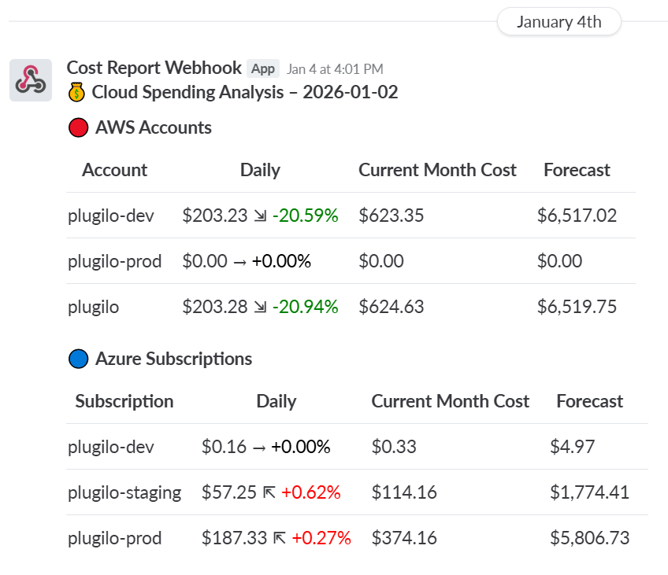

# Plugilo Infrastructure

This document outlines the cost management and FinOps strategy for Plugilo's global SaaS platform.

## Part 4 – Cost Management & FinOps

### 1. Context and Requirements

**Platform:**
- 10–15 million users
- Microservices architecture
- Backend services in Node.js / Python / Java
- Databases: PostgreSQL, MongoDB, Elasticsearch, Redis
- AI workloads (GPU optional; no deep ML required)
- Web & mobile clients (Web, iOS, Android)
- Deployed on Azure (primary) with multi-cloud connectivity to AWS and GCP

**Key Requirements:**
- Strong cost discipline (startup mindset)
- Cost visibility and ownership
- Budget alerts and monitoring
- Cost vs performance trade-offs
- Responsible scaling

---

## 2. Cost Visibility and Ownership

**Cost Allocation:**
Based on Cloud Adoption Framework (CAF) and Landing Zone architecture principles (applicable across all cloud providers), each product is separated at a specific level:
- **Azure**: Subscription
- **AWS**: Account
- **GCP**: Project
- **Kubernetes**: Namespace

Cost allocation is achieved at these top-level boundaries, eliminating the need for complex tagging strategies on individual resources.

---

## 3. Resource Tagging Strategy

Resource tag standardization is a crucial practice in cloud infrastructure management that involves applying consistent metadata labels (tags) to cloud resources. These tags help in organizing, tracking, managing, and analyzing cloud resources across various platforms, including AWS, Azure, GCP, and Kubernetes.

Tags are key-value pairs that provide additional information about resources, enabling better:
- **Resource organization and identification**: Group and locate resources efficiently
- **Cost allocation and billing**: Track and attribute costs accurately
- **Access control and security management**: Enforce security policies based on tags
- **Automation and operational efficiency**: Automate operations using tag-based filters
- **Monitoring and reporting capabilities**: Generate reports and dashboards by tag

Standardizing tags across different cloud platforms and tools ensures consistency in resource management and enables effective cross-platform operations and monitoring.

### 3.1 Mandatory Tags

**Decision: BudgetComponent/CostCenter as Primary Tag**

**Rationale:**
We apply the **BudgetComponent** (or **CostCenter**) tag only at top-level boundaries (subscription/account/project/namespace), not on individual underlying resources.

**Required Tags (Enforced by Azure Policy):**
- **BudgetComponent** (or **CostCenter**): Applied at subscription/account/project/namespace level only (e.g., `aa`, `sci`, `ai`)

> **Note:** Past experience with over-engineering (20+ different tags) showed minimal impact. This simplified approach focuses on the most critical tag at the appropriate architectural boundary. Information like environment or region is already captured in resource naming conventions, eliminating the need for additional tags.

### 3.2 Tag Enforcement and Remediation

**Decision: IaC-Level Enforcement with OPA Policies**

**Rationale:**
Each cloud platform has its own enforcement mechanisms:
- **Azure**: Azure Policy
- **AWS**: Service Control Policies (SCP), AWS Tag Policy
- **GCP**: Organization Policies

However, these native enforcement approaches often cause additional cost (policy evaluation overhead, compliance scanning services).

**Approach:**
Enforce tag requirements at the Infrastructure as Code (IaC) level using Terraform with Open Policy Agent (OPA) policies during CI/CD pipeline execution.

---

## 4. Budget Alerts and Monitoring

### 4.1 Budget Configuration

**Budget Definition Process:**
Monthly budgets and budget alerts must be defined before creating resources through sizing and collaboration with the product team to set proper values. All cloud providers have separate solutions but achieve the same result:

- **Azure**: Azure Budgets
- **AWS**: AWS Budgets
- **GCP**: GCP Budgets and Alerts

### 4.2 Cost Monitoring

**Decision: Two-Phase Approach for Cost Monitoring**

**Rationale:**
Cost monitoring requires collecting billing data from multiple sources:
- **Cloud Platforms**: Azure, AWS, GCP
- **SaaS Services**: GitHub, Tailscale, and other third-party services

Tracking costs across these diverse sources is challenging, as each platform has different billing APIs and reporting formats.

**Approach 1: Scheduled Application with Webhook Integration (Current)**

Create a scheduled application that:
- Calls billing APIs from all platforms (Azure Cost Management API, AWS Cost Explorer API, GCP Billing API, GitHub API, Tailscale API, etc.)
- Aggregates and formats the cost data
- Sends daily cost reports to messaging channels via webhooks (Slack, Teams, etc.)

**Implementation:**
- **Scheduled Job**: Runs daily (e.g., via Kubernetes CronJob)
- **Multi-Platform Integration**: Connects to all billing APIs
- **Webhook Delivery**: Sends formatted reports to Slack/Teams channels
- **Cost Breakdown**: Includes daily cost, current month cost, forecast, and percentage changes

  

**Approach 2: Grafana with FOCUS Format (Future Goal)**

Centralize dashboard based on billing data in [FOCUS (FinOps Open Cost & Usage Specification)](https://focus.finops.org/) format. All three cloud providers (Azure, AWS, GCP) support exporting and querying billing data in FOCUS format, which can be stored in object storage.

By combining these data sources in Grafana, detailed billing information is exposed as dashboards for users, enabling alerting based on those metrics.

**Implementation:**
- **FOCUS Format Export**: Export billing data from Azure, AWS, GCP in FOCUS format
- **Object Storage**: Store FOCUS-formatted billing data in object storage
- **Grafana Data Source**: Configure Grafana to query FOCUS-formatted data from object storage
- **Centralized Dashboards**: Create unified dashboards showing cost across all platforms
- **Alerting**: Set up alerts based on Grafana metrics

**Migration Strategy:**
Approach 2 is more complex to implement, so we start with Approach 1 (scheduled application with webhooks) and gradually migrate to Approach 2 (Grafana with FOCUS). During the transition, all cloud platforms continue to support individual solutions, but the end goal is centralized monitoring.

**Cost Alerts:**
- **Daily Cost Spike**: Alert if daily cost increases > 20% from previous day
- **Weekly Cost Spike**: Alert if weekly cost increases > 30% from previous week
- **Monthly Cost Spike**: Alert if monthly cost increases > 50% from previous month
- **Resource-Specific Alerts**: Alerts for expensive resources (e.g., large VMs, unused resources)

---

## 5. Cost Optimization Solution

### 5.1 Right-Sizing

**Problem:** Kubernetes resources are often over-provisioned (e.g., requesting 7.64TiB Memory, 3100 Cores CPU but using only 2.6TiB, 460 Cores), resulting in ~78% resource waste.

**Goals:** Assess utilization, identify over/under-provisioning, optimize requests/limits, achieve cost savings. **Target Metrics:** 80% utilization, < 35% idle (moonshot: < 20%), usage/request ratio > 65% (ideally 80%).

**Process:**

1. **Assess**: Access dashboards (Datadog, Prometheus/Grafana), identify namespaces with > 35% idle, calculate savings
2. **Analyze**: Review CPU/memory usage over 1-4 weeks, identify over-provisioned resources (usage < 65% of requests), document current requests/limits and scaling policies
3. **Optimize Replicas**: Calculate min replicas = `max(actual CPU usage / CPU request, actual Memory usage / Memory limit)`, adjust scaling thresholds (60-75% CPU utilization), optimize cron-based scaling
4. **Optimize Requests/Limits**: CPU request = p99 usage + 20% buffer, Memory request = max usage + 20% buffer, CPU limit = 2× request (burst), Memory limit = request (guaranteed QoS)
5. **Iterate**: Deploy gradually (staging → production), monitor performance/utilization, iterate to achieve < 35% idle

> **Note:** Cost optimization depends heavily on metrics from the observability system to make informed decisions about resource utilization, idle resources, and optimization opportunities.

### 5.2 Waste Reduction

**Decision: Turn Off Unused Resources During Off-Hours**

**Approach:** Identify and shut down unused resources during non-business hours to reduce costs.

**Implementation:**
- **Resource Identification**: Use observability metrics to identify resources with zero/low utilization during off-hours
- **Automated Shutdown**: Schedule Kubernetes CronJobs or use KEDA CronScaler to scale down deployments to 0 replicas during off-hours
- **Selective Shutdown**: Target non-production environments (development, staging) and non-critical services
- **Business Hours**: Define off-hours based on business requirements (e.g., weekends, nights, holidays)

**Benefits:** Immediate cost savings for resources that are not needed 24/7, especially in development/staging environments.

### 5.3 Spot Instances

**Decision: Use Spot Instances for Cost Optimization**

**Approach:** Leverage spot instances for non-critical workloads to achieve up to 70% cost savings.

**Implementation:**
- **Workload Selection**: Use spot instances for stateless workloads, batch jobs, and non-critical services
- **Node Selection**: Configure node selectors/tolerations to schedule pods on spot instance node pools
- **Pod Disruption Budgets**: Implement PDBs to prevent too many pods from being evicted simultaneously
- **Graceful Shutdown**: Applications handle SIGTERM signals for graceful shutdown on spot eviction

**StatefulSet Considerations (High Skill Required):**
- **Spark on Kubernetes**: 
  - Executor pods only on spot instances (stateless, can be replaced)
  - Driver pod on dedicated node (stateful, must remain stable)
  - Enable checkpointing for streaming jobs to recover from executor failures
  - Implement retry mechanisms for failed tasks
- **Database Workloads**: Avoid spot instances for primary databases; consider for read replicas only
- **Stateful Applications**: Evaluate carefully - ensure data persistence and recovery mechanisms are in place

**Trade-offs:** 30-second eviction notice, variable performance, requires robust error handling and retry logic.

### 5.4 Reserved Instances

**Decision: Commit to Reserved Instances for Predictable Workloads**

**Approach:** Purchase 1-year or 3-year reservations for stable, predictable workloads to achieve up to 72% cost savings.

**Implementation:**
- **Workload Analysis**: Identify workloads with consistent resource requirements (production baseline, always-on services)
- **Reservation Strategy**: 
  - **1-year reservations**: For stable workloads with predictable capacity
  - **3-year reservations**: For long-term stable workloads (maximum savings)
- **Instance Type Selection**: Match reservation to actual node instance types used in production
- **Regional Strategy**: Align reservations with primary deployment regions

**Benefits:** Significant cost savings (up to 72%) for predictable workloads, guaranteed capacity.

**Trade-offs:** Reduced flexibility, upfront commitment, requires accurate capacity planning.

---

## 6. Cost vs Performance Trade-offs

**Decision:** Production environments prioritize stability for customers, while non-production environments prioritize cost optimization since developers work on them most of the time.

---

## 7. When to Scale Up vs Optimize

### 7.1 Scale Up Decision Criteria

**Scale Up When:**
- There will be or existing business impact if not scaling production immediately
- Proper sizing evidence from product team when performance testing and require higher compute

### 7.2 Optimize Decision Criteria

**Optimize When:** See [Section 5: Cost Optimization Solution](#5-cost-optimization-solution) for detailed optimization strategies (right-sizing, waste reduction, spot instances, reserved instances).

---

## 8. Technical Debt Acceptance Example

**Data Platform: Spark on Kubernetes with Spot Instances**

**Scenario:**
Data Platform runs Spark workloads on Kubernetes and requests cost reduction without impacting business stability.

**Challenge:**
Spot instances can reduce costs by up to 70%, but Spark jobs may fail when spot nodes are evicted (30-second notice), potentially impacting data processing pipelines and business operations.

**Solution:**

**1. Spark Application Retry Mechanism**
- Implement automatic retry logic for failed Spark jobs
- Configure retry policies (max retries, backoff strategy, exponential delay)
- Integrate with job scheduling system (e.g., Airflow, Kubernetes CronJob) to handle retries

**2. Pod Placement Strategy**
- **Executors on Spot Nodes**: Schedule executor pods on spot instance node pools using node selectors/tolerations
  - Executors are stateless and can be replaced if evicted
  - Multiple executors provide redundancy
- **Driver Pod on Dedicated Node**: Schedule driver pod on dedicated (on-demand) node pool
  - Driver maintains job state and coordinates executors
  - Driver failure would require full job restart
  - Dedicated node ensures driver stability

**3. Checkpointing for Streaming Jobs**
- **Enable Checkpointing**: Configure Spark Structured Streaming to checkpoint to object storage (Azure Blob Storage, AWS S3, GCP Cloud Storage)
- **Recovery from Checkpoint**: Streaming jobs automatically resume from last checkpoint after executor eviction
- **State Store**: Use reliable state store (e.g., HDFS, object storage) for stateful streaming operations

**Implementation:**
- **Node Pools**: Create separate node pools (spot for executors, dedicated for driver)
- **Pod Templates**: Use Kubernetes pod templates with node selectors/tolerations
- **Pod Disruption Budgets**: Configure PDBs to limit concurrent executor evictions
- **Monitoring**: Alert on frequent spot evictions and job failures

**Cost Savings:** Up to 70% reduction in compute costs for executor nodes while maintaining job reliability.

**Trade-off:** Increased operational complexity (retry logic, checkpointing configuration) and potential job delays during spot evictions, but acceptable given significant cost savings and maintained business stability.

---

## 9. Required Questions

### 9.1 If cloud costs double in one month, what do you do in the first week?

1. **Check Cost Monitoring and Alerts**: If everything is working correctly, there should be no chance that costs double in one month without notice. Investigate why monitoring/alerts failed to detect the cost increase.

2. **Download Daily Billing Data**: Check which day the spike occurred, then identify resource IDs causing the spike.

3. **Isolate and Communicate**: Isolate the resources, communicate with other teams to make a decision whether to stop, delete, or keep those resources.

4. **Root Cause Analysis**: If the cost was created or updated by mistake, identify root cause (IaC misconfiguration, permissions, etc.) and document lessons learned.

### 9.2 How do you respond when Product requests scaling beyond budget limits?

1. **Understand the Request**: Business justification, timeline, scale requirements, and budget impact.

2. **Cost-Benefit Analysis**: Evaluate business value (revenue impact, customer satisfaction) vs cost increase. Consider alternative solutions (optimization instead of scaling).

3. **Present Options**: Full scaling (meets requirements, high cost), optimized scaling (partial requirements, lower cost), or phased scaling (gradual, cost spread over time).

4. **Decision**: If business justification is strong, approve with budget increase and set monitoring. If weak, propose optimization alternatives or phased approach.

5. **Implementation**: Phased rollout to validate need, monitor cost/performance, continuously optimize, and review regularly.

---

