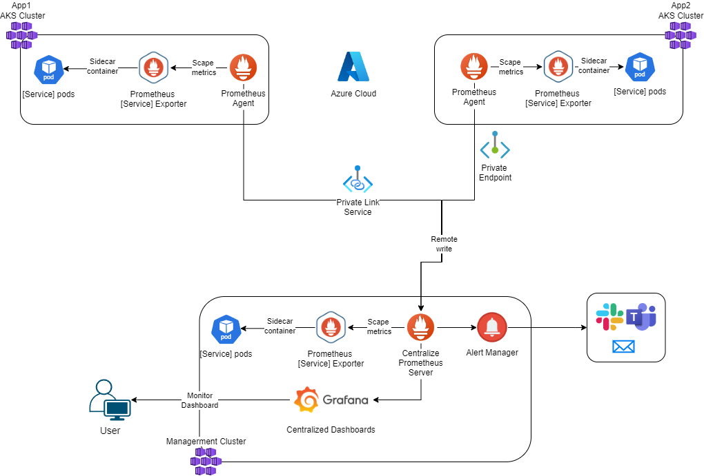
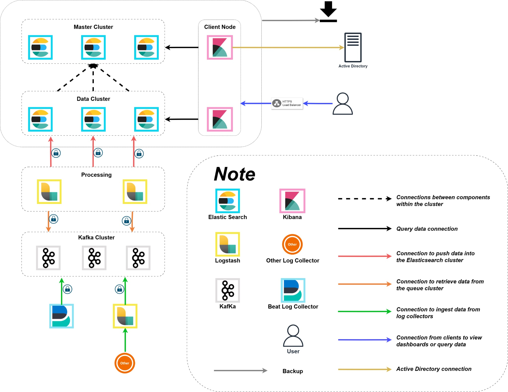
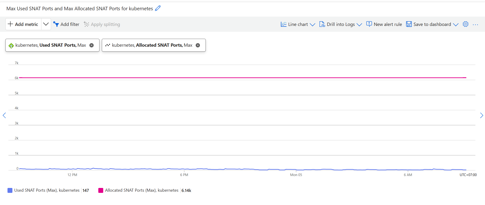

# Plugilo Infrastructure

This document outlines the observability and operations strategy for Plugilo's global SaaS platform.

## Part 5 – Observability & Operations

### 1. Context and Requirements

**Platform:**
- 10–15 million users
- Microservices architecture
- Backend services in Node.js / Python / Java
- Databases: PostgreSQL, MongoDB, Elasticsearch, Redis
- AI workloads (GPU optional; no deep ML required)
- Web & mobile clients (Web, iOS, Android)
- Deployed on Azure (primary) with multi-cloud connectivity to AWS and GCP

**Key Requirements:**
- Comprehensive observability (metrics, logs, traces)
- Effective alerting strategy
- SLOs, SLAs, and error budgets
- On-call rotation and incident response
- Runbooks and operational procedures
- Postmortem and learning culture

---

## 2. Metrics, Logs, and Traces

### 2.1 Metrics

**Decision: Prometheus Multi-Cluster Federation with Centralized Prometheus Server**

<strong>Figure 1: Prometheus Multi-Cluster Federation Architecture</strong>

**Architecture:**
- **Application Clusters**: Prometheus agents collect metrics locally, send to centralized server via Azure Private Link Service
- **Management Cluster**: Centralized Prometheus Server aggregates metrics from all clusters via remote write
- **Metrics Flow**: Application pods (exporters) → Prometheus agents → Private Link → Centralized Prometheus Server

**Metrics Categories:**
- **Infrastructure**: CPU, memory, disk, network (Node Exporter, cAdvisor)
- **Application**: Request rate, error rate, latency (application instrumentation)
- **Business**: User signups, transactions, revenue (application events)
- **Kubernetes**: Pod status, node health, resource utilization (kube-state-metrics)

**Visualization and Retention:**
- **Grafana**: Centralized dashboards querying Prometheus Server
- **Alert Manager**: Routes alerts to Slack, Teams, Email
- **Retention**: 15 days (Prometheus), 1 year optional (Thanos/S3)

### 2.2 Logs

**Decision: ELK Stack with Kafka for Log Aggregation and Processing**

<strong>Figure 2: ELK Stack with Kafka Log Architecture</strong>

**Architecture:**
- **Log Collectors**: Filebeat, Metricbeat, custom collectors gather logs from applications, containers, infrastructure
- **Kafka Queue**: Three Kafka instances buffer logs during high-volume periods, prevent data loss, decouple collection from processing
- **Logstash Processing**: Three Logstash instances pull from Kafka, parse/enrich/transform, push to Elasticsearch
- **Elasticsearch Cluster**: Data nodes (3), master nodes (3), client nodes with Kibana (2) for high availability

**Log Flow:** Collectors → Kafka (buffering) → Logstash (processing) → Elasticsearch (storage) → Kibana (visualization)

**Authentication and Access:**
- **Active Directory**: Kibana authenticates via AD
- **HTTPS Load Balancer**: Secure access to Kibana dashboards
- **RBAC**: Role-based access control for log access

**Log Sources:** Application logs (structured JSON), container logs (stdout/stderr), infrastructure logs (system/audit/security), access logs (API Gateway/Load Balancer/WAF)

**Retention:** Elasticsearch 90 days (searchable), Azure Blob Storage 1 year (cold storage/compliance)

### 2.3 Traces

**Decision: Elastic APM for Distributed Tracing**

**Architecture:**
- **Elastic APM**: Integrated with existing ELK stack for trace collection, storage, and visualization
- **APM Agents**: Language-specific agents (Node.js, Python, Java) instrument applications
- **Istio**: Service mesh provides automatic tracing for inter-service communication

**Trace Sampling:**
- **Production**: 1% sampling (reduce overhead, capture representative traces)
- **Staging**: 10% sampling (higher sampling for testing)
- **Development**: 100% sampling (full traces for debugging)

**Trace Retention:**
- **Elasticsearch**: 7 days (hot storage, searchable traces)
- **Azure Blob Storage**: 30 days (cold storage, compliance)

---

## 3. Alerting Strategy

**Alert Severity Levels:**
- **P0 (Critical)**: Immediate page - production down, data breach, credential leak
- **P1 (High)**: Page within 5 minutes - partial outage, security vulnerability
- **P2 (Medium)**: Page within 15 minutes - performance degradation, non-critical issues
- **P3 (Low)**: Email notification only - minor issues, non-production incidents

**Alert Routing (PagerDuty):**
- **P0**: Immediate page (no delay)
- **P1**: Page after 5 minutes if unacknowledged
- **P2**: Page after 15 minutes if unacknowledged
- **P3**: Email notification only
- **Channels**: PagerDuty (primary), Slack (#alerts), Email, Grafana dashboards

**Alert Rules:** See Section 8.1 for detailed alert rules by component and metric.

---

## 4. SLOs, SLAs, and Error Budgets

**Service Level Objectives (SLOs):**
- **Availability**: 99.9% uptime (8.76 hours downtime/year), 30-day rolling window
- **Latency**: P95 < 500ms, P99 < 1s, 30-day rolling window
- **Error Rate**: < 0.1% (1 error per 1000 requests), 30-day rolling window

**Service Level Agreements (SLAs):**
- **Customer-Facing**: 99.9% uptime, P95 < 500ms response time, < 4 hours support response for critical issues
- **Internal**: P0 incident response < 15 minutes, P1 < 1 hour, zero-downtime deployments, MTTR < 15 minutes for P0

**Error Budgets:**
- **Calculation**: 0.1% availability downtime, 0.1% error rate, 0.1% requests exceeding P95 threshold
- **Policy**: < 50% consumed (normal operations), 50-75% (caution), 75-100% (critical fixes only), > 100% (freeze deployments)
- **Tracking**: Monitor consumption, alert at > 50%, freeze deployments if exhausted

---

## 5. On-Call Rotation

**On-Call Structure:**
- **Primary On-Call**: Weekly rotation among Infrastructure team members, 24/7 coverage, escalate to Infrastructure Lead if unresolved after 30 minutes
- **Secondary On-Call**: Backup for P0 incidents, available for escalation
- **PagerDuty**: Rotating schedules, multi-level escalation (Engineer → Team Lead → Infrastructure Lead → CTO), notifications via phone/SMS/email/mobile app

**Product Team DevOps Engineer Rotation:**
- **Rotation**: Each product team has a dedicated DevOps engineer rotating on 2-week basis
- **Knowledge Transfer**: Regular knowledge transfer sessions during rotation to share product-specific knowledge
- **Goal**: Infrastructure team gains deep knowledge about each product over time

**On-Call Responsibilities:**
- Acknowledge P0/P1 alerts within 15 minutes, investigate and diagnose issues, resolve or escalate, document incidents

---

## 6. Runbooks

**Runbook Structure:**
- **Template**: Title, severity (P0/P1/P2/P3), symptoms, root cause, resolution steps, verification, prevention

**Common Runbooks:**
- **Infrastructure**: Node failure, pod crashloop, database connection issues, high CPU/memory
- **Application**: High error rate, high latency, service unavailable
- **Database**: Database failover, replication lag, connection pool exhausted

**Maintenance:**
- **Updates**: Quarterly reviews, post-incident updates with lessons learned
- **Storage**: Version controlled in Git repository, accessible in incident management system

---

## 7. Postmortem and Learning Culture

**Postmortem Process:**
- **Timeline**: Initial summary within 24 hours, detailed document within 1 week, review meeting within 2 weeks
- **Template**: Incident summary, timeline, root cause (5 Whys), impact, resolution, action items (immediate/short-term/long-term), lessons learned

**Learning Culture:**
- **Blameless**: Focus on process improvements, not individual blame
- **Knowledge Sharing**: Share postmortems with team, maintain incident database, document best practices
- **Continuous Improvement**: Update processes and tooling based on findings, provide training on common patterns

---

## 8. Required Questions

### 8.1 Which alerts should page immediately vs be monitored passively?

**Metric Categories:**

**Work Metrics**: Measures useful system output (queries answered, pages served, requests processed). Used for availability management and alerting.

**Resource Metrics**: Measures resource consumption (CPU, memory, disk, network). Used for capacity planning, dashboard only, no alerts.

**Immediate Page - Work Metrics:**

| Component | Metrics | Alert Condition |
|-----------|---------|----------------|
| Front Door/WAF | Request count, 5XX error rate, response time | Sudden dropping/increasing, error rate, sudden deterioration or threshold exceedance |
| Application Gateway | 5XX rate, target 5XX rate, request count, response time | Sudden deterioration or threshold exceedance, sudden dropping/increasing |
| Application | Pod status | Check pod status |
| Database | Deadlocks, aborted clients, database connections, DML latency | Sudden deterioration or threshold exceedance |
| SSL/TLS | Certificate expiration | Check remaining days (synthetics API test) |

**Passive Monitoring - Resource Metrics:**

| Component | Metrics | Monitoring Approach |
|-----------|---------|-------------------|
| Application Gateway | Active connections, new connection count, 2xx/3xx/4xx/5xx, target 2xx/3xx/4xx/5xx | Dashboard only |
| Application | Container restart count, disk I/O, network I/O | Dashboard only |
| Database | IOPS | Dashboard only |

### 8.2 Describe a major production incident you handled and how you approached it

**Incident: AKS SNAT Port Exhaustion During Azure Migration**

**Context:** Migrating entire on-premises infrastructure to Azure with AKS and Azure managed services (PostgreSQL, Redis, etc.).

**Incident Summary:**
- **When**: During production DNS cutover after migration
- **Impact**: Users experiencing 5xx errors after DNS switch, despite successful E2E testing
- **Duration**: ~2 hours

**Investigation:**
- Checked all infrastructure metrics (pod status, CPU, memory, DB connections, DTU) - all normal
- Contacted Microsoft support (production incident)
- Tester suggested Redis cache - checked Redis metrics, still normal
- Noticed Redis was public (no private endpoint/VNet integration)
- Checked rare metrics (SNAT ports) - identified root cause

**Root Cause:** AKS SNAT port exhaustion due to excessive Redis calls to public endpoint. Each Redis call consumed a SNAT port from the limited pool, exhausting ports under production load.

  

<strong>Figure 3: SNAT Port Exhaustion - Used vs Allocated Ports</strong>

**Resolution:**
- **Immediate**: Increased maximum SNAT ports per AKS node to recover service
- **Long-term**: Implemented Azure Private Link for all Azure services (Redis, PostgreSQL, etc.) to eliminate SNAT port consumption

**Lessons Learned:**
- Rare metrics matter: Common metrics may appear normal while rare metrics (SNAT ports) reveal the issue
- Private endpoints critical: Public endpoints consume SNAT ports; private endpoints eliminate this
- E2E testing limitations: Limited load testing doesn't reveal SNAT port exhaustion under production traffic
- Migration checklist: Must include private endpoint configuration for all Azure services

**Prevention:**
- Added SNAT port usage alerts (alert at 80% utilization)
- Mandatory private endpoint configuration for all Azure services in migration checklist
- Updated runbooks with SNAT port troubleshooting
- All new Azure services must use private endpoints by default

---

